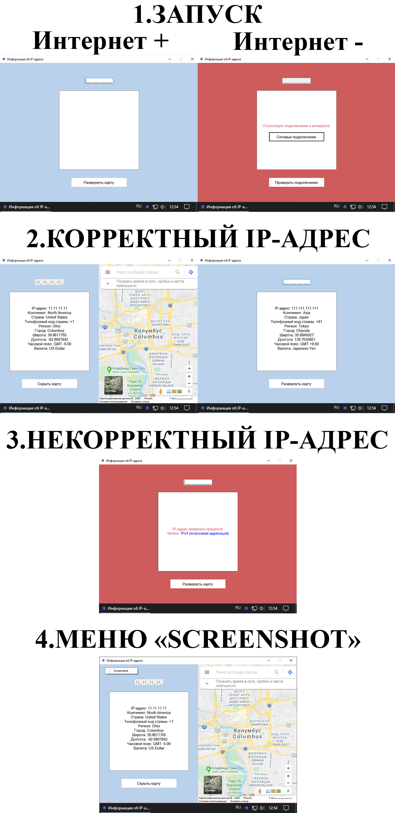

# Find_by_ip
Задание (сам себе):
>1. программа должна держать связь с интернетом;
>2. при запуске программы в реестре, по пути "Компьютер\HKEY_CURRENT_USER\Software\Microsoft\Internet Explorer\Main\FeatureControl\FEATURE_BROWSER_EMULATION", создает параметр "FindByIp.exe" (DWORD) со значением 11000 в шестнадцатеричной системе счисления. Параметр необходим для отключения в webBrowser сообщения "Вы включили просмотр в режиме совместимости с Internet Explorer. Выключите эту функцию, чтобы избежать неполадок в работе Google Карт";
>3. при запуске программы окно имеет плавное появление;
>4. после появления окна происходит отображение состояния подключения к интернету;
>5. при отсутствии интернета цвет фона меняется на IndianRed и выводится графическое предупреждение с кнопкой "Сетевые подключения", которая проводит юзера по пути "Панель управления\Сеть и Интернет\Сетевые подключения" для возможности подключить интернет;
>6. по нажатию на кнопку сворачивания, окно должно оставаться в панели задач;
>7. программа должна уметь разворачиваться из трей, если она была свернута ранее;
>8. клик правой кнопкой мыши по внутренней части формы, вызывает контекстное меню с параметром "Screenshot", предназначенное для сохранения скриншота с формы в формате jpg, png или bmp по пути, который укажет пользователь;
>9. если пользователь не имеет соединения с интернетом / ввел в ошибочном формате IPv4-адрес, тогда при сохранении скриншота будет предложено стандартное название "Screenshot №1", но дальнейшее сохранение скриншотов, с наличием предупреждений в форме, приведет к инкрементальной нумерации в один шаг в названии файла после "Screenshot № "; 
>10. если пользователь вводит IPv4-адрес неверного формата, то цвет фона меняется на IndianRed и выводится графическое предупреждение со ссылкй на статью в wiki "IPv4 (Классовая адресация)";
>11. при корректном вводе IPv4-адреса из правой части формы выезжает, отцентрованная на городе с даным IPv4-адресом, google-карта;
>12. если юзеру мешает выпадающая панель goolge-карты, то клика мыши в карту свернет данную панель;
>13. если юзер не потерял соединение с интернетом, то по нажатию на кнопку "Скрыть карту" (правая часть формы) произойдет сворачивание google-карты в правой части до изначального (свернутого) состояния, при этом поле для ввода IPv4-адресе очищается, но информация об IPv4-адресе остается доступной для копирования или создания скриншота;
>14. если, при открытой google-карте, у юзера исчезнет интернет соединение, то по нажатию на кнопку "Скрыть карту" цвет фона меняется на IndianRed, google-карта сворачивается до изначального (свернутого) состояния, а вся доступная информация об IPv4 заменяется на графическое предупреждение с кнопкой "Сетевые подключения", которая проводит юзера по пути "Панель управления\Сеть и Интернет\Сетевые подключения" для возможности подключить интернет;
>15. пользователь должен иметь возможность копировать отображаемые данные об IPv4-адресе из определенной области на форме;
>16. выход из программы возможен по нажатию на кнопку закрытия формы, либо кликом по полю "Закрыть" иконки в трей, либо по ALT+F4;
>17. при выходе из программы из реестра удаляется параметр "FindByIp.exe".

Ограничения:
>1. программа отображает не более 10000 запросов в месяц;
>2. требуется .NET Framework 4.7.2 и выше;
>3. программа проверяет только глобальные IPv4-адреса.

Подытог: вот такенный майндфак на выходе
>
